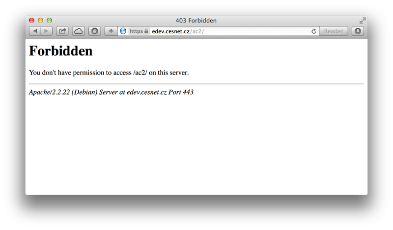
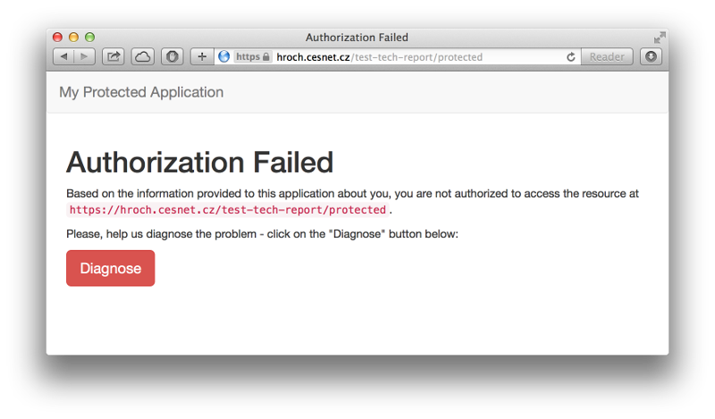
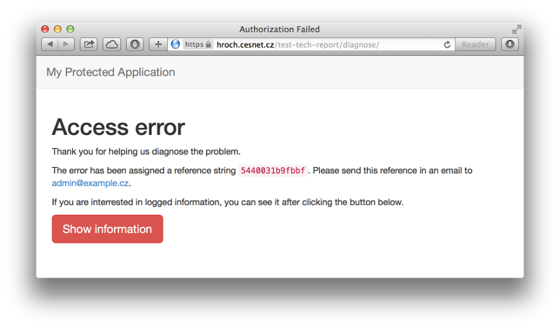

# Shibboleth Service Provider Access Control

## Introduction
As the number of online services is growing, so grows the number of usernames and passwords used to login which is uncomfortable for users. Simultaneously, user management is getting very time consuming and more complicated which is uncomfortable for organizations operating these services. This unpleasant issue is very well addressed by the federated identity technology, implemented by the open-source project Shibboleth [Shibboleth](http://shibboleth.net). This software implements both the essential elements of a federated identity access, i.e. an Identity Provider (IdP) and a Service Provider (SP).

Accessing a private resource is preceded by two steps. The first is authentication (i.e. determining who the user is) and the second is authorization (i.e. deciding whether the user is allowed to access the resource or not). This second step (authorization, access control, ...) is the main topic of this technical report. Without proper access control management all users are allowed to use any service which is probably not a desired situation.

There are basically two main approaches to access control in a federated environment. It is access control at the IdP side and access control at the SP side. Access control managed by an IdP is associated with `eduPersonEntitlement` attribute to name at least one. "Entitlements represent an assertion of authorization to something, precomputed and asserted by the identity provider. This attribute is typically used to assert privileges maintained centrally [Entitlements](https://www.incommon.org/federation/attributesummary.html)." On one hand, the IdP sets attribute values that enable a user to log in. On the other hand, the SP still decides about allowing access. If access control at the SP side is deployed, the SP lets in only the user whose attributes match criteria. Thus, both approaches are quite similar, but still not the same.

Access control at the SP side can be performed either at the Shibboleth level or at the application level. Both ways have their advantages and disadvantages. The Shibboleth level is far more easier to implement, but when it comes to error handling, we are very limited as only a small set of variables are available to properly inform the user about what went wrong and how to solve it. Controlling access at the application level handles errors better, however, the application has to be modified which might be a very time consuming and complex task or even impossible. In this technical report, we will describe in detail how to implement access control at the Shibboleth SP level.

The solution presented here assumes that an Identity Provider supplies a Service Provider with various user attributes. Those attributes in cooperation with entity attributes defined in federation metadata are used to precisely control access to a service. For example, a user coming from a particular IdP (entity category) will only be allowed to access a resource if a user attribute from IdP matches a rule. This helps to filter users based on their attributes and the IdP they are coming from.

## Technical Background
Service Provider access control, as stated above, can be performed in Shibboleth itself or in the application a user is logging in. However, before creating access control rules, SAML (Security Assertion Markup Language) attributes have to be mapped to the corresponding environment variables (or optionally HTTP headers), otherwise the SP ignores them [NativeSPAddAttribute](https://wiki.shibboleth.net/confluence/display/SHIB2/NativeSPAddAttribute).

Attribute mapping is defined in the `attribute-map.xml` configuration file. Each attribute is mapped using an `&lt;Attribute&gt;` element. For example, to map user’s email address to a local variable `mail`, we need to provide the code of the attribute `urn:oid:0.9.2342.19200300.100.1.3` and the name of the local variable:

```xml
<Attribute name="urn:oid:0.9.2342.19200300.100.1.3" id="mail"/>
```

Once the attributes are mapped, they can be used for access control. Two methods are available. The first is to use the XML-based mechanism provided by the Shibboleth SP and the second is to use Apache style access control if Apache [Apache](http://httpd.apache.org) is the web server under the SP.

Apache users can place access control rules in `&lt;Directory&gt;`, `&lt;File&gt;` and `&lt;Location&gt;` blocks in the main configuration or in a separate per-directory `.htaccess` file. There is a number of rule types described in the official Shibboleth documentation [NativeSPhtaccess](https://wiki.shibboleth.net/confluence/display/SHIB2/NativeSPhtaccess). Regular expressions and a modifier to invert the rule might be used in access control definitions. For example, the following rule allows everyone except students from Czech institutions to access a secured resource:

```apache
Require shib-attr affiliation ! ~ ^student@*\.cz$
```

However, compared to the XML-based mechanism, this approach offers only limited choices to filter access. XML-based mechanism rules can be put into two places. The first place is inline placement in the `shibboleth2.xml` configuration file. The second place is an external configuration file which is referenced from the Apache configuration. In both cases, access rules have to be written under `&lt;AccessControl&gt;` root element. Moreover, if using external file, thus not writing access control definition into `shibboleth2.xml` configuration file, `type` attribute with value `edu.internet2.middleware.shibboleth.sp.provider.XMLAccessControl` must be added to the `&lt;AccessControl&gt;` element [NativeSPXMLAccessControl](https://wiki.shibboleth.net/confluence/display/SHIB2/NativeSPXMLAccessControl).

There are various child elements to format access rules in a simple, boolean-capable language. Regular expressions might be mixed with operators such as AND, OR and NOT in order to precisely define rules [NativeSPXMLAccessControl](https://wiki.shibboleth.net/confluence/display/SHIB2/NativeSPXMLAccessControl). In the following example, the access control rules are placed in an external file and allow access to all CESNET users, who have logged in using their password with the exception of user "jop":

```xml
<AccessControl type="edu.internet2.middleware.shibboleth.sp.provider.XMLAccessControl">
    <AND>
        <RuleRegex require="affiliation">^.+@cesnet\.cz$</Rule>
        <NOT>
            <Rule require="user">jop@cesnet.cz</Rule>
        </NOT>
        <OR>
            <Rule require="authnContextClassRef">urn:oasis:names:tc:SAML:2.0:ac:classes:Password</Rule>
        </OR>
    </AND>
</AccessControl>
```

Not only users’ attributes from IdPs can be used to filter access. It is also possible to use information from sources such as federation metadata, i.e. entity categories. In this case, Shibboleth SP needs to map entity attributes from metadata similarly as in the case with users’ attributes released by an IdP. Although attributes extracted from metadata should be prefixed in order to be distinguishable from users’ attributes. This is explained in more detail and with examples in the following section.

## Example Use Case
CESNET [CESNET](http://www.cesnet.cz) operates eduID.cz [eduID.cz](http://www.eduid.cz) federation which was designated for academic users only. However, non-academic users are present in the federation nowadays. One example of such users are graduate students who still have their university accounts. Another example are public library users.  These non-academic users should not have access to some federation resources due to various reasons like licenses, etc.

Although the solution we present is not the only one possible, we have decided to implement it, since administrators of SPs that do not care about public library users do not need to change anything in their SP configuration. Only those SPs' administrators that would like to disallow access to public library users have to alter their configuration.

The objective is to allow only library employees to consume services and to restrict other persons from library IdPs. For our filter, we will thus use the value of the attribute affiliation released by IdPs and the value of the entity attribute from federation metadata that indicates that the IdP is a library. The access control filter using the mentioned attribute values is saved in an external XML format file.

In the following subsections, we present our solution to filter users based on `affiliation` attribute that have to match the regular expression `^employee@.+\.cz$`, i.e. only employees from Czech organizations are allowed.

### Shibboleth Configuration
We have to set a prefix for metadata attributes in `shibboleth2.xml` file inside `&lt;ApplicationDefaults&gt;` element. Setting this option will prefix attributes extracted from metadata with that value and enable applications to differentiate between attributes about the user and attributes about the user's identity provider [NativeSPApplication](https://wiki.shibboleth.net/confluence/display/SHIB2/NativeSPApplication).

To set the prefix to `md_` ("md" stands for metadata) value, edit `shibboleth2.xml` appropriately:

```xml
<ApplicationDefaults entityID="https://example.org/shibboleth/" metadataAttributePrefix="md_">
```

Next, we can define attribute mapping in `attribute-map.xml` file. The following fragment placed into the IdP’s metadata shows the definition of the entity attribute. It describes the IdP as a public library:

```xml
<mdattr:EntityAttributes>
    <saml:Attribute Name="http://macedir.org/entity-category" NameFormat="urn:oasis:names:tc:SAML:2.0:attrname-format:uri">
        <saml:AttributeValue>http://eduid.cz/uri/idp-group/library</saml:AttributeValue>
    </saml:Attribute>
</mdattr:EntityAttributes>
```

So, mapping our attribute to `entityCategory` variable can be done using the following code:

```xml
<Attribute name="http://macedir.org/entity-category" id="entityCategory" />
```

In this situation, `entityCategory` variable prefixed with `md_` string contains the value of the attribute (in our example `http://eduid.cz/uri/idp-group/library`) which can be used to create XML-based access control rules:

```xml
<AccessControl type="edu.internet2.middleware.shibboleth.sp.provider.XMLAccessControl">
    <OR>    
        <RuleRegex require="affiliation">^employee@.+\.cz$</RuleRegex>    
            <NOT>    
                <Rule require="md_entityCategory">http://eduid.cz/uri/idp-group/library</Rule>       
            </NOT>    
    </OR>    
</AccessControl>
```

This access control allows only users with `eduPersonScopedAffiliation` attribute matching regular expression `^employee@.+\.cz$`, if they are coming from an IdP operated by a library. Additional information about writing rules is available in the official Shibboleth documentation [NativeSPXMLAccessControl](https://wiki.shibboleth.net/confluence/display/SHIB2/NativeSPXMLAccessControl).

### Apache Configuration
Apache needs to know which directory we mean to protect by a Shibboleth session. Let us assume that the directory is `/limit/access`. To this directory, we intend to allow access only to users with a specific affiliation value. The ACL (Access Control List) definition as stated above is placed in the `/path/to/ac.xml` file.

Code snippet for Apache would then look like this:

```apache
<Directory /limit/access>
    AuthType shibboleth
    ShibRequestSetting requireSession 1
    ShibAccessControl /path/to/ac.xml 
</Directory>
```

For more detailed information about Apache configuration see the official Shibboleth documentation [NativeSPApacheConfig](https://wiki.shibboleth.net/confluence/display/SHIB2/NativeSPApacheConfig).

## Other Use Cases
The presented solution might be deployed in a number of various situations where access control is required as it is easy and clear. A few more extra examples on top of the previously mentioned use case follow.

1. Although teachers and students have their accounts from the same university, teachers are allowed to use an application for planning exams, while students are not. And on the contrary, students are allowed to use an application for applying for exams, while teachers are not.

    Application for planning exams ACL definition:

    ```xml
    <AccessControl type="edu.internet2.middleware.shibboleth.sp.provider.XMLAccessControl">
        <NOT>
            <RuleRegex require="affiliation">^student@.+\.cz$</RuleRegex>
        </NOT>
    </AccessControl>
    ```

    Application for applying for exams ACL definition:

    ```xml
    <AccessControl type="edu.internet2.middleware.shibboleth.sp.provider.XMLAccessControl">
        <RuleRegex require="affiliation">^student@.+\.cz$</RuleRegex>
    </AccessControl>
    ```

2. An application that requires to identify a user unambiguously. This can be performed by using three various attributes. They are, for example, `ePPN` (eduPersonPrincipalName) attribute, `targetedID` attribute or `email` address. An incoming user is accepted to view the resource when any of the mentioned attributes match the filter rules.

    ACL definition:

    ```xml
    <AccessControl type="edu.internet2.middleware.shibboleth.sp.provider.XMLAccessControl">
        <OR>
            <RuleRegex require="eduPersonPrincipalName">.+</RuleRegex>
            <RuleRegex require="eduPersonTargetedId">.+</RuleRegex>
            <RuleRegex require="mail">.+@.+\.cz</RuleRegex>
        </OR>
    </AccessControl>
    ```

3. Data banks with scientific papers and other materials have contracts with universities to allow accessing content. However, only students should have access to resources provided.

    ACL definition:

    ```xml
    <AccessControl type="edu.internet2.middleware.shibboleth.sp.provider.XMLAccessControl">
        <RuleRegex require="affiliation">^student@.+\.cz$</RuleRegex>
    </AccessControl>
    ```

## Issues
One issue that may appear with this type of access control is related to attribute release. There are basically two scenarios. In the first scenario, the IdP does not release the required attribute to all the SPs in the federation. Even worse, the IdP might not release the attribute at all. In the second scenario, the attribute is released, however, chances are that the value is different from the expected. In such situations, proper error handling should take place to inform the user about what has gone wrong.

Every SP in a federation should periodically download current federation metadata in order to be up to date. However, there may exist SPs which do not update their metadata regularly. In that case, the SP is not informed about the entity category used for access control and thus access control will fail, i.e. will take no effect. To avoid this issue, entities in a federation should have current metadata downloaded periodically.

If an error occurs, we do not know the reason. There are two approaches. First, redirecting user to a web page to log environment variables and trying to diagnose what has happened. Second, integrating access control to the application users are logging in. The second approach improve the user experience, but it is far more complicated to implement and sometimes even impossible. In this document, we are focusing on the first variant in the following subsection.



### Diagnosing login failure
Although Shibboleth SP provides very flexible access control tools, in case of an access error, only a generic page is displayed providing too little information. There is no error message in the log either, so the administrator has no further information available. The reasons for the access error may be:

1. User's attribute values do not comply with the specified access control definitions.
2. Some of the attributes used in the access control definitions are missing.

In both cases, it is necessary that the administrator gets notified about the problem and receives as much information as possible. Although it is possible to customize the standard Shibboleth SP access error page using the appropriate template, it provides very few options.

One possible workaround is to make the standard Shibboleth SP access error page redirect the user to a custom error page, where the error can be diagnosed. To use prepared example error page, download `accessError.html` page from our repository [ErrorHandling](https://github.com/CESNET/shibboleth-sp-access-control/tree/master/access_errors) and configure Shibboleth SP configuration file `shibboleth2.xml`.

```xml
<Errors supportContact="admin@example.cz"
    logoLocation="/shibboleth-sp/logo.jpg"
    styleSheet="//maxcdn.bootstrapcdn.com/bootstrap/3.2.0/css/bootstrap.min.css"
    access="/path/to/accessError.html"
    ...
/>
```



The `accessError.html` page links to a PHP script `accessError.php` that provides diagnostics. In our example page, the address is `/test-tech-report/diagnose`. For obvious reasons that page must be also protected by Shibboleth, but with no access control rules. Apache configuration should be altered similarly to the following:

```apache
<Location /test-tech-report/diagnose>
    AuthType shibboleth
    ShibRequestSetting requireSession 1
    require valid-user
</Location>
```

The custom error page `accessError.php` may analyze available user attributes, log all available information (such as environment variables, time, etc.) into a log file at the server and display a more comprehensive error description to the user.



All files including configuration example is available in our repository [ErrorHandling](https://github.com/CESNET/shibboleth-sp-access-control/tree/master/access_errors).

## Conclusion
In this technical report, we have described a situation in our federation that requires implementing access control mechanism. The method we have decided to follow is easy to implement and does not cause any service interruptions while deploying. Additionally, if there is no need for access control at a particular SP, nothing has to be done at all.

For the presented solution we have used entity categories, which help us to categorize particular IdPs. On the category of an IdP, we can perform access control similarly to user attributes.

